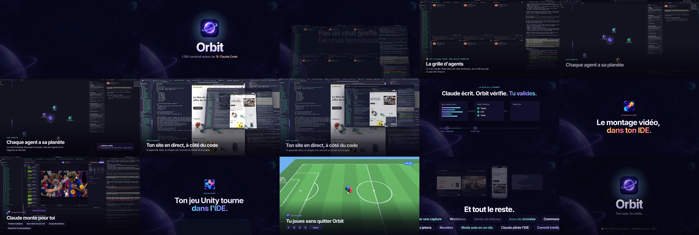

<p align="center"></p>

<h1 align="center">Orbit</h1>

<p align="center"><b>L'IDE construit autour des agents de code.</b><br>
Claude Code ou ChatGPT (Codex) dans de vrais terminaux, et un éditeur qui sait ce que fait chacun d'eux.</p>

<p align="center">
<a href="https://github.com/jahid611/orbit-ide/releases/latest"></a>
&nbsp;
<a href="https://github.com/jahid611/orbit-ide/releases/latest"></a>
</p>

<p align="center"></p>

Orbit est un fork de VS Code (Code - OSS 1.140). Ce n'est pas un chat greffé sur un éditeur : c'est le vrai programme de ton agent, avec ton propre abonnement, dans des terminaux qu'Orbit organise, surveille et relie au reste de l'éditeur.

## Installer

| Système | Fichier | À savoir |
|---|---|---|
| **Windows 10 / 11 (x64)** | [`OrbitSetup-x64-….exe`](https://github.com/jahid611/orbit-ide/releases/latest) | L'installateur n'est pas signé : sur l'écran « Windows a protégé votre ordinateur », clique sur *Informations complémentaires* puis *Exécuter quand même*. |
| **macOS (Apple Silicon)** | [`Orbit-mac-arm64-….zip`](https://github.com/jahid611/orbit-ide/releases/latest) | Glisse Orbit dans Applications. Au premier lancement : *Réglages Système › Confidentialité et sécurité › Ouvrir quand même*. |
| **Linux** | depuis les sources | Voir [Construire Orbit](#construire-orbit). |

Il te faut aussi **[Claude Code](https://claude.com/claude-code)** (ou **Codex** pour ChatGPT) installé et connecté : c'est lui qui travaille dans les terminaux d'Orbit. Orbit n'utilise jamais de clé d'API payée à l'usage, il retire même celles qui traînent dans l'environnement.

Orbit se met à jour tout seul : il prévient quand une version sort et l'installe à la fermeture (Windows), ou ouvre la page de téléchargement (macOS).

## Ce qu'Orbit fait

**Des agents, pas un chat**

- **Terminaux d'agents** : onglets, splits, grille de 2 à 6 agents, un worktree git par agent.
- **Statut en direct** sur chaque onglet (travaille, attend ton accord, a fini), notifications, y compris sur ton téléphone.
- **Vue Orbite** : le projet au centre, chaque agent en planète, ses fichiers en lunes, les collisions en rouge.
- **Radar de collision** : alerte dès que deux agents modifient le même fichier.
- **Chef d'équipe** et **chef d'orchestre** : un agent découpe la tâche, crée les autres, puis les branches sont fusionnées.
- **File de nuit** et **tableau de tâches** : empile le travail, retrouve un compte rendu par tâche.
- **Discussions reliées au projet** : chaque dossier retrouve ses discussions, même déplacé ou renommé.

**Une boucle fermée**

- **Vérification automatique** : types, lint et tests relancés à la fin de chaque tour, les échecs renvoyés à l'agent.
- **Relecture visuelle** : captures avant et après d'une page modifiée, que l'agent regarde lui-même.
- **Machine à remonter le temps** : une photo du projet à chaque message, retour arrière par tour ou par fichier.
- **Vue vivante** : ton site à côté du code, 14 appareils, un clic sur un élément remonte au fichier et à la ligne.

**Des outils dans l'éditeur**

- **StarCapture**, un éditeur vidéo complet (timeline, sous-titres mot par mot, coupe des silences, export rapide) que l'agent sait piloter.
- **NovaGame**, l'atelier de jeux Unity : la scène, l'inspecteur et le jeu jouable dans Orbit.
- **Vercel**, **Supabase**, **Stripe**, **Figma vers code**, **Higgsfield**, variables d'environnement cachées aux agents, base de données, magasin de connecteurs.
- **Lecteurs** de PDF, de présentations PowerPoint et de polices.
- **Studio** de personnalisation : six thèmes, fond d'écran, dispositions, CSS libre.

Le détail de chaque fonction, l'architecture et les pièges connus sont dans [`ORBIT.md`](ORBIT.md).

## Construire Orbit

```bash
git clone https://github.com/jahid611/orbit-ide.git
cd orbit-ide
nvm install 24.18.0 && nvm use 24.18.0
npm ci
npm run compile
./scripts/code.sh ~/un-projet        # Windows : .\scripts\code.bat C:\un-projet
```

Prérequis : Git, Python 3, un compilateur C++ (Xcode Command Line Tools sur macOS ; Visual Studio Build Tools 2022 avec les bibliothèques « atténuation Spectre » sur Windows). L'application installable se construit avec `npm run gulp vscode-win32-x64-min` ou `vscode-darwin-arm64-min` ; les installateurs publiés sont fabriqués par [`.github/workflows/orbit-release.yml`](.github/workflows/orbit-release.yml).

## Licence

Orbit est distribué sous licence [MIT](LICENSE.txt), comme Code - OSS dont il est issu (© Microsoft Corporation pour le code d'origine). Orbit n'est affilié ni à Microsoft, ni à Anthropic, ni à OpenAI ; « Visual Studio Code », « Claude » et « ChatGPT » sont des marques de leurs propriétaires respectifs.
