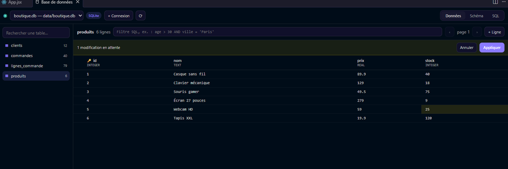
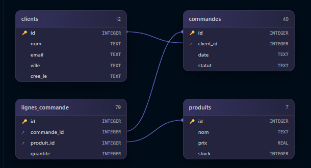

# Base de données

Orbit trouve tout seul les bases du projet : fichiers **SQLite** et adresses **PostgreSQL / Supabase** des fichiers `.env` (`DATABASE_URL`, `DIRECT_URL`, `POSTGRES_URL`…). « + Connexion » en ajoute d'autres ; l'adresse est gardée dans le coffre sécurisé de l'IDE.

- **Données** : parcours, trie, filtre (`ville = 'Paris'`). Double-clique une cellule pour la modifier, ajoute ou supprime des lignes : tout reste **en attente** jusqu'à **Appliquer**, puis passe en une seule transaction.
- **Schéma** : les tables en cartes, reliées par leurs clés étrangères. Glisse-les pour les ranger ; double-clique une table pour voir ses données.

- **SQL** : écris et exécute tes requêtes.
- **Claude**, en bas : « les 10 clients qui commandent le plus », « ajoute une colonne avatar », « génère 20 lignes de test ». Claude propose la requête avec une explication ; tu la relis, tu l'exécutes.
- **Confier à Claude** : pour les gros chantiers (migrations, scripts, refonte du schéma), la demande part dans un terminal Claude avec le schéma et l'emplacement de la base.

**Sécurité**

- Toute requête qui modifie la base (badge rouge « Modifie la base ») demande une confirmation.
- Les modifications de la grille sont tout ou rien : si une seule échoue (clé étrangère, valeur unique…), **rien** n'est modifié et Orbit explique pourquoi.
- Les tables sans clé primaire sont en lecture seule dans la grille.

**Pièges**

- Le filtre et l'onglet SQL exécutent ce que tu écris : sur une base de production, préfère une copie.
- Les bases hébergées (Supabase…) passent en connexion chiffrée ; les bases locales non.
