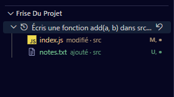

# Machine à remonter le temps

Chaque message envoyé à un agent crée un **point de sauvegarde de tout le projet**, puis un second quand l'agent a fini. La **Frise du projet** (barre latérale Orbit) liste ces tours : déplie-en un pour voir les fichiers ajoutés, modifiés ou supprimés, et clique un fichier pour comparer avant et après.

**Revenir en arrière** (flèche à droite d'un tour) remet le projet exactement comme il était juste avant ce message : les fichiers modifiés reprennent leur contenu, ceux créés depuis disparaissent.

**À savoir**

- Tout est capturé, pas seulement les modifications de Claude : commandes shell, scripts, formateurs, et tes propres changements.
- Un retour arrière est lui-même annulable : l'état d'avant reste dans la frise (« Retour avant… »).
- Les sauvegardes vivent hors du projet (`~/.orbit/snapshots`) et **ne touchent jamais ton dépôt git** : ni commit, ni branche, ni index.
- Le bouton disquette crée un point de sauvegarde à la main, avant une manipulation risquée.

**Pièges**

- Arrête les agents avant de revenir en arrière : un agent encore au travail continuerait d'écrire par-dessus.
- Avec plusieurs agents dans le même dossier, un tour montre tout ce qui a changé pendant ce temps, y compris le travail des autres.
- `node_modules`, `.venv`, `.next` et les fichiers ignorés par ton `.gitignore` ne sont pas sauvegardés.
