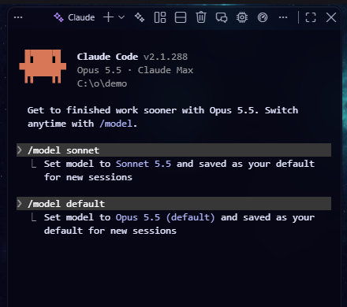

# Changer de modèle en un clic

Le bouton envoie `/model …` au terminal Claude courant : le changement est immédiat, sans relancer la session.

**Pièges**

- Claude Code **mémorise ce choix comme modèle par défaut** pour tes prochaines sessions, y compris hors d'Orbit.
- Si Claude attend une autorisation dans ce terminal, Orbit refuse d'envoyer la commande : elle répondrait à la question à ta place. Réponds d'abord.
- Sans terminal Claude ouvert, le choix devient le modèle des prochains terminaux (réglage `orbit.claude.model`).
