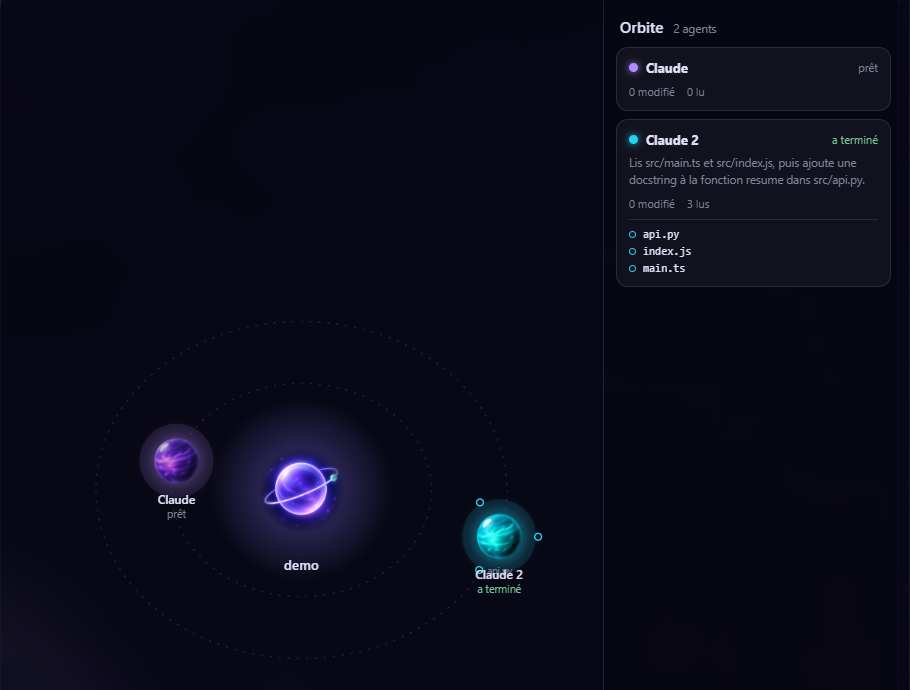
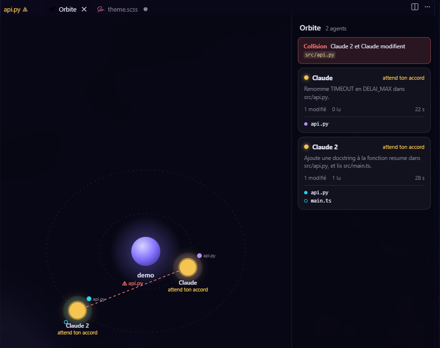

# La tour de contrôle : vue Orbite

Le projet est au centre, chaque agent est une planète. Ses **lunes** sont les fichiers de son tour de travail : pleine = il le **modifie**, creuse = il le **lit**. Clique une planète pour aller à son terminal, un fichier pour l'ouvrir.

Dans l'explorateur, les mêmes traces apparaissent sur les fichiers : l'initiale de l'agent à côté du fichier, en couleur quand il le modifie, en minuscule grise quand il le lit.

## Radar de collision

Dès que deux agents modifient le même fichier, le fichier est marqué d'un « ! » orange, une alerte s'affiche et un trait rouge relie les deux planètes.

**À savoir**

- Les traces d'un agent s'effacent à son message suivant : la carte montre le tour en cours, pas l'historique.
- Seules les modifications faites avec les outils d'édition de Claude sont suivies. Un fichier modifié par une commande shell (`sed`, un script, un formateur) n'est pas vu.
- Raccourci : **Ctrl+Alt+O** (⌥⌘O sur Mac).
