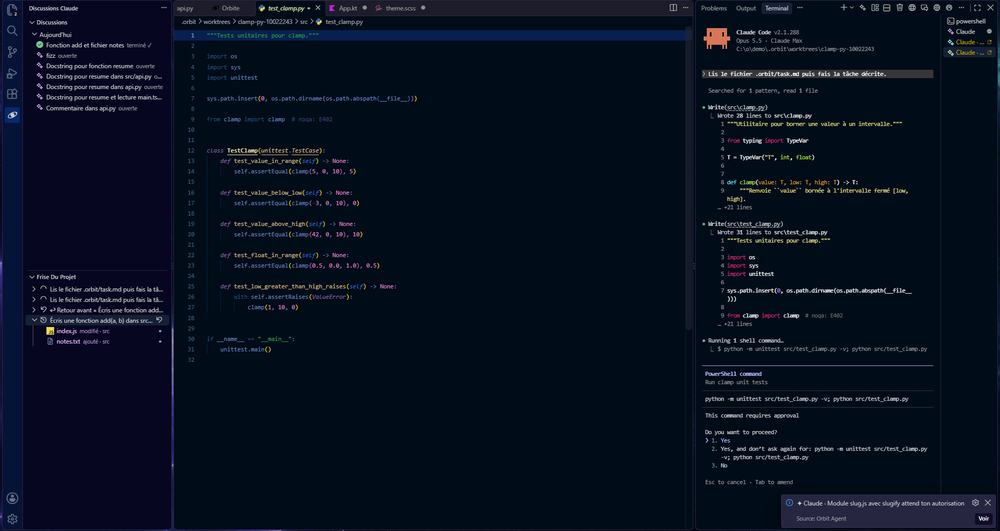

# Chef d'orchestre

Donne une grosse tâche : Claude la **découpe en 2 à 4 sous-tâches** qui touchent des fichiers différents. Tu vois le plan, tu décoches ce que tu ne veux pas, puis Orbit lance **un agent par sous-tâche**, chacun dans sa propre branche git et son propre dossier (`.orbit/worktrees`). Ils travaillent en même temps, sous tes yeux dans la vue Orbite.

Quand tous ont terminé, **Fusionner** ramène leurs branches dans ton projet (un commit par agent, puis une fusion), et propose de supprimer leurs dossiers et leurs branches.

**À savoir**

- Le projet doit être un dépôt git avec au moins un commit, et git doit connaître ton identité (`git config --global user.name` et `user.email`) : les commits de fusion sont à ton nom.
- Les agents sont lancés en mode « accepter les modifications » (sauf réglage contraire) : ils écrivent librement dans leur dossier isolé, mais te demandent avant toute commande.
- La consigne de chaque agent est dans `.orbit/task.md` de son dossier ; `.orbit/` est ignoré par git.
- « Fusionner » marche aussi après un redémarrage : Orbit retrouve les branches `orbit/…` encore ouvertes.

**Pièges**

- Commite ou mets de côté tes propres modifications avant de fusionner : Orbit refuse sinon, pour ne pas les mélanger au travail des agents.
- Si deux agents ont quand même touché le même fichier, la fusion de la seconde branche s'arrête : elle reste à traiter à la main, son dossier est conservé.
- Plusieurs agents consomment plusieurs fois ton abonnement : garde un œil sur le compteur d'utilisation.
