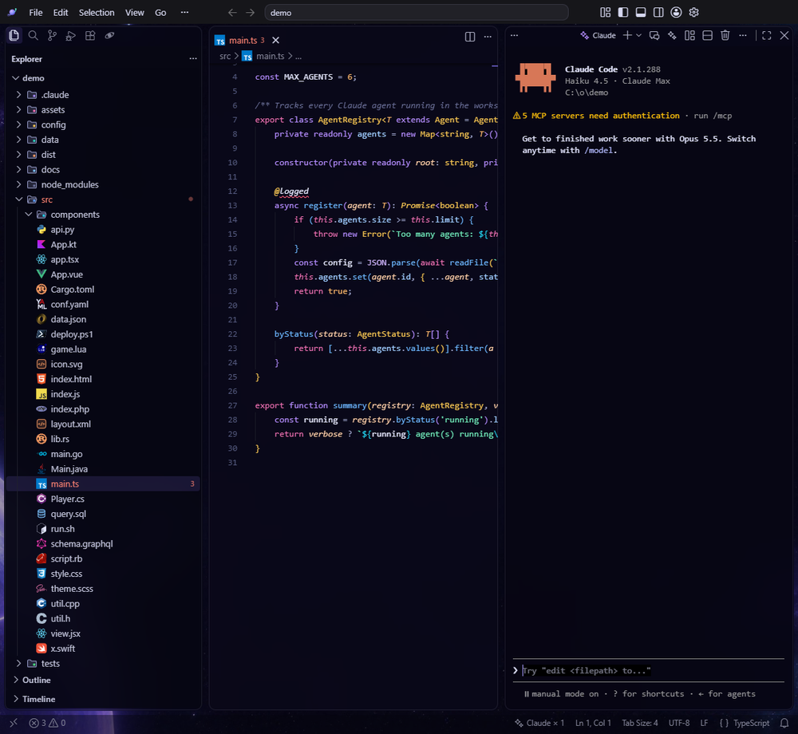

# Claude vit dans de vrais terminaux

Chaque terminal « Claude » est une session Claude Code complète : mêmes commandes (`/model`, `/usage`, `/resume`…), mêmes raccourcis, même abonnement.

| Action | Windows / Linux | Mac |
|---|---|---|
| Aller au terminal Claude | Ctrl+L | ⌘L |
| Nouveau terminal Claude | Ctrl+Alt+N | ⌥⌘N |

**À savoir**

- Un terminal Claude s'ouvre tout seul quand tu ouvres un projet (réglage `orbit.claude.autoStart`).
- Sans projet ouvert, Orbit te propose d'en créer un dans `~/Orbit` : Claude écrit toujours dans un dossier que tu vois.
- La facturation passe par ton **abonnement Claude**. Orbit retire les clés API de l'environnement de ces terminaux pour éviter une facturation à l'usage par accident (réglage `orbit.claude.billing`).
- Les fichiers que Claude crée s'ouvrent en aperçu dans l'éditeur, sans te faire quitter le terminal.
