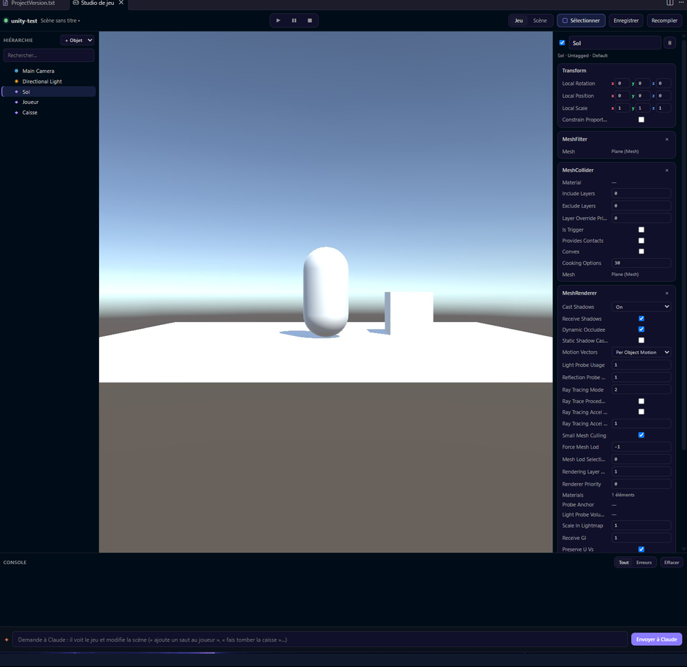

# Studio de jeu Unity

Ouvre le dossier d'un projet Unity dans Orbit, puis le **Studio de jeu** (Ctrl+Alt+U ou ⌥⌘U). Au premier lancement, Orbit propose d'**installer le pont** : un petit paquet d'éditeur (`Packages/com.orbit.bridge`) qui relie Unity à Orbit. Il ne s'inclut jamais dans tes builds.

- **Vue Jeu / Scène en direct** : ce que voit la caméra, rafraîchi en continu. **Sélectionner** (ou `S`) puis un clic sur un objet le sélectionne aussi dans Unity.
- **Hiérarchie** : tous les objets de la scène ; double-clic pour centrer la vue Scène dessus. « + Objet » crée un cube, une sphère, un sol…
- **Inspecteur** : chaque composant et ses valeurs. Modifie positions, rotations, couleurs, nombres, cases à cocher : c'est appliqué tout de suite dans Unity (Ctrl+Z dans Unity pour annuler). « ouvrir le script » ouvre le C# du composant.
- **Lecture / Pause / Stop**, **Enregistrer**, **Recompiler**.
- **Console** : messages de Unity ; un clic sur `Fichier.cs:42` ouvre la ligne ; **Corriger avec Claude** envoie l'erreur, le fichier et la pile à Claude.

## NovaGame

L'onglet **NovaGame** (la manette de la barre de gauche) rassemble tout : **Ouvrir le bac à sable** (un projet Unity d'essai, créé et configuré tout seul, avec une scène où marcher), **Nouveau jeu**, tes jeux, et l'état de la configuration. Si Unity n'est pas installé, NovaGame t'emmène à l'installateur et reprend là où tu en étais.

**Jouer ici** lance le jeu dans Orbit : clique dans l'image pour prendre la souris, joue au clavier, Échap pour sortir. Le jeu doit utiliser le paquet Input System (c'est le cas du bac à sable et des jeux créés par NovaGame). Un jeu qui lit l'ancienne classe `Input` affiche le bouton **Adapter le jeu** : Claude le convertit.

## Claude agit dans Unity

Dans un projet Unity, les terminaux Claude reçoivent les **outils orbit-unity** : Claude voit le jeu (captures), lit la hiérarchie et l'inspecteur, crée des objets, ajoute des composants, règle des valeurs, recompile, lit la console et lance le jeu. Demande-lui un gameplay complet (« un joueur qui saute », « des ennemis qui patrouillent ») : il écrit les scripts C#, les branche dans la scène et vérifie le résultat.

**À savoir**

- Unity doit être ouvert à côté : Orbit le pilote, il ne le remplace pas. Bouton « Ouvrir dans Unity » si besoin.
- Unity ne relit les fichiers modifiés que quand sa fenêtre reprend la main : après un changement de script, clique dans Unity ou utilise **Recompiler**.
- Les changements faits pendant la Lecture sont perdus à l'arrêt, comme dans Unity.

**Pièges**

- Les outils orbit-unity demandent une autorisation à chaque appel ; « ne plus demander » les autorise pour la session.
- Une scène jamais enregistrée est rangée dans `Assets/Scenes` quand Orbit ou Claude l'enregistre.
