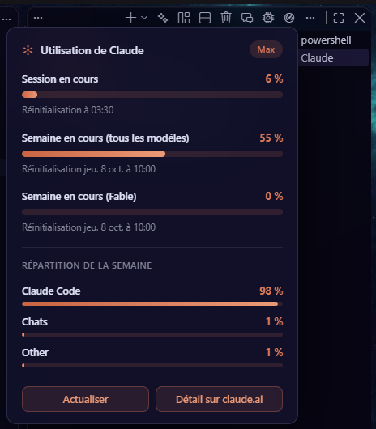

# Surveiller ton abonnement

La carte montre la **session en cours** (fenêtre de 5 heures), la **semaine** tous modèles confondus, les limites par modèle et la répartition de la semaine. Le compteur en bas à droite de la fenêtre (« session · semaine ») l'ouvre aussi.

**À savoir**

- Une barre passe au rouge à partir de 90 %.
- Orbit lit la connexion que Claude Code garde sur ta machine ; il ne la renouvelle jamais lui-même. Si la carte indique « connexion expirée », ouvre un terminal Claude puis actualise.
- Avec une facturation par clé API, ces limites ne s'appliquent pas et le compteur disparaît.
