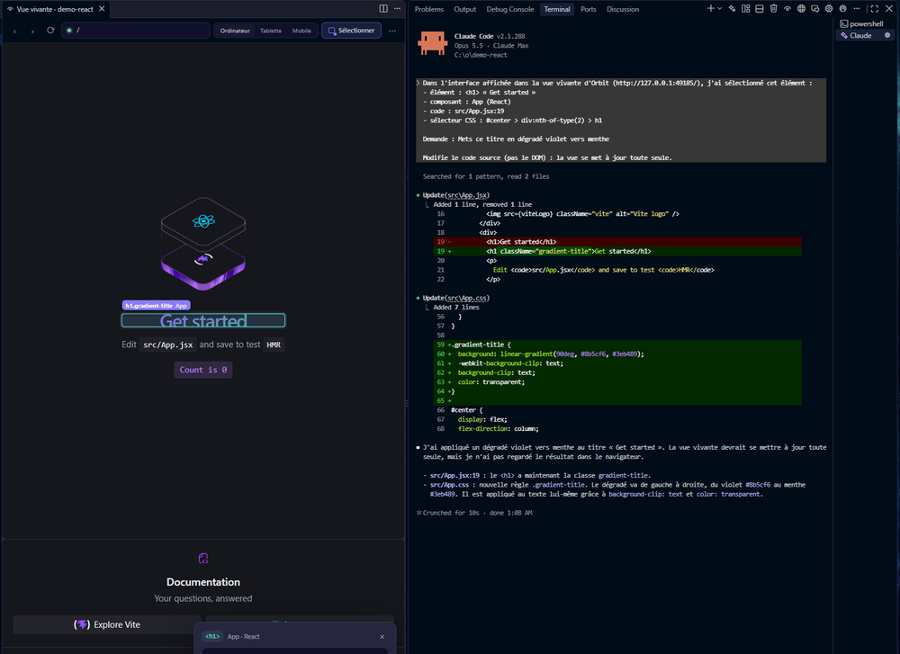

# Vue vivante

Affiche ton interface (serveur de développement React, Vue, Svelte, Next… ou simple page HTML) **à côté du code**. Clique **Sélectionner** (ou touche `S`), puis un élément : un titre, une carte, un bouton.

- **Envoyer à Claude** : décris le changement (ou clique une suggestion). Claude reçoit l'élément, son composant, **le fichier et la ligne exacts** et son sélecteur CSS. Dès qu'il modifie le code, la vue se met à jour toute seule.
- **Aller au code** : ouvre le fichier pile sur la ligne qui affiche l'élément.
- **Ordinateur / Tablette / Mobile** : prévisualise les tailles d'écran.

**À savoir**

- Orbit détecte les serveurs lancés sur les ports habituels (5173, 3000, 4321…) ; sinon choisis « Autre adresse ».
- Les pages HTML du projet sont servies par Orbit et rechargées à chaque enregistrement, en gardant la position de défilement.
- L'emplacement est exact avec React (y compris React 19), Svelte et les pages HTML. Pour Vue, Orbit connaît le composant et cherche la ligne. Quand l'emplacement est deviné, il est marqué « probable ».
- La page passe par un petit relais local d'Orbit qui y ajoute l'inspecteur : ton application n'est pas modifiée.

**Pièges**

- Un site en `https` ou sur une autre machine n'est pas pris en charge : la vue vivante sert au développement local.
- En mode Sélectionner, les clics ne déclenchent plus les boutons de la page : repasse en navigation (Échap) pour les utiliser.
