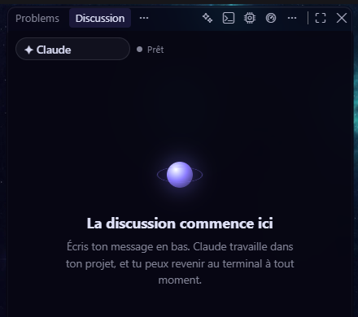

# Terminal ou discussion : le même Claude

La **vue discussion** affiche la conversation comme un chat et envoie ce que tu écris dans le terminal. Ce n'est pas un second Claude : tu peux commencer dans l'une et finir dans l'autre.

- Bascule : **Ctrl+Alt+T** (⌥⌘T sur Mac), ou le bouton de la barre du panneau.
- Les boutons **vue**, **modèle** et **utilisation** sont au même endroit dans les deux vues : à droite de la barre, juste avant « … ».

**Pièges**

- Quand Claude demande une autorisation, les boutons de la vue discussion envoient des touches au terminal. En cas de doute, repasse en vue terminal pour répondre : c'est lui qui fait foi.
- Les fenêtres propres au terminal (comme `/usage` ou le choix du modèle de Claude Code) n'apparaissent pas dans la discussion ; utilise les boutons d'Orbit ou la vue terminal.
